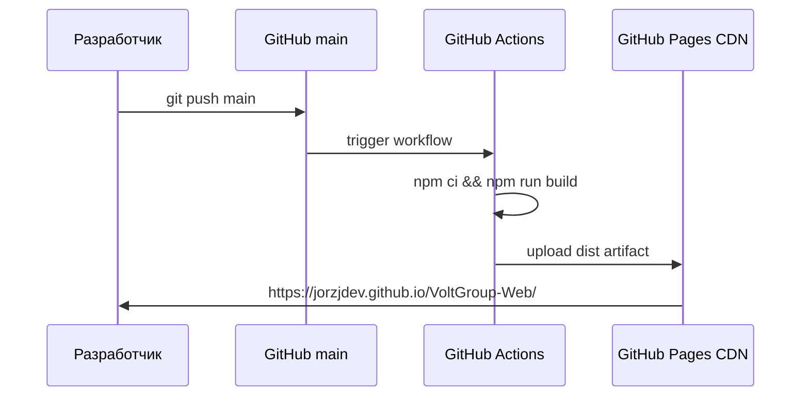

# План: публикация VoltGroup-Web на GitHub Pages

## Цель

Опубликовать сайт по адресу:

**https://jorzjdev.github.io/VoltGroup-Web/**

Деплой — **автоматически** при каждом `push` в ветку `main` через GitHub Actions.

---

## Что нужно от вас (заказчик)

| # | Действие | Зачем |
|---|----------|--------|
| 1 | Убедиться, что репозиторий **публичный** (или GitHub Pro для Pages на private) | Иначе Pages не заработает на бесплатном тарифе |
| 2 | **Закоммитить и запушить** весь текущий код в `origin/main` | Сейчас на GitHub только README; сайт локально не запушен |
| 3 | В GitHub: **Settings → Pages → Build and deployment → Source: GitHub Actions** | Без этого workflow не опубликует сайт |
| 4 | При первом запуске workflow: подтвердить окружение **`github-pages`** (если GitHub попросит) | One-time для Actions deploy |
| 5 | (Опционально) После деплоя проверить сайт в браузере и прислать скрин, если что-то сломано | Приёмка |

**Доступы:** push в репозиторий `jorzjdev/VoltGroup-Web` у вас уже есть (SSH `git@github.com:jorzjdev/VoltGroup-Web.git`).

**Не нужно от вас:** отдельный сервер, PHP, база данных — только GitHub.

---

## Текущее состояние проекта

- Репозиторий: `git@github.com:jorzjdev/VoltGroup-Web.git`, ветка `main`
- Сборка: `npm run build` → папка `dist/`
- В `vite.config.js`: **`base: './'`** — подходит для обычного хостинга, **не подходит** для GitHub Pages в подпапке репозитория
- Workflow **`.github/workflows/`** — ещё нет
- Локально много **не закоммиченных** файлов (сайт, plan, package.json и т.д.)

---

## Архитектура деплоя



---

## Этапы реализации (в коде)

### Этап 1 — `base` для GitHub Pages

В [`vite.config.js`](../vite.config.js) задать:

```js
base: '/VoltGroup-Web/',
```

Имя **должно совпадать** с именем репозитория на GitHub (регистр важен: `VoltGroup-Web`).

**Проверка локально после смены:**

```bash
npm run build
npm run preview
# открыть http://localhost:4173/VoltGroup-Web/
```

**Альтернатива (удобнее dev):** `base` через переменную — production `/VoltGroup-Web/`, dev `./`. Можно заложить в том же этапе.

---

### Этап 2 — Workflow GitHub Actions

Создать файл [`.github/workflows/deploy-pages.yml`](../.github/workflows/deploy-pages.yml):

- Триггер: `push` на `main`, опционально `workflow_dispatch` (ручной запуск)
- Node 20, `npm ci`, `npm run build`
- Артефакт: `dist`
- Деплой: `actions/deploy-pages@v4`
- Permissions: `pages: write`, `id-token: write`

---

### Этап 3 — `.gitignore`

Убедиться, что в репозиторий **не попадают**:

- `node_modules/`
- `dist/` (собирается на CI)

Обычно уже есть в [`.gitignore`](../.gitignore).

---

### Этап 4 — Коммит и push

```bash
git add .
git commit -m "Add site and GitHub Pages deploy workflow"
git push origin main
```

*(Сообщение коммита — по вашему стилю.)*

---

### Этап 5 — Настройка GitHub (вручную в браузере)

1. Открыть https://github.com/jorzjdev/VoltGroup-Web/settings/pages  
2. **Build and deployment → Source:** `GitHub Actions` (не «Deploy from a branch»)  
3. Вкладка **Actions** → дождаться зелёного workflow **Deploy to GitHub Pages**  
4. Через 1–3 минуты открыть URL из Settings → Pages или из лога job `deploy`

---

## Критерии готовности

- [ ] Workflow на `main` завершается успешно (зелёный)
- [ ] Открывается https://jorzjdev.github.io/VoltGroup-Web/
- [ ] Главная: стили, шрифты, картинки, переключатель темы
- [ ] Работают `pages/portfolio.html`, `pages/about.html` и остальные заглушки
- [ ] Якоря на главной (`#about`, `#contacts`) работают
- [ ] В консоли браузера нет массовых 404 на `/assets/...`

---

## Типичные проблемы

| Симптом | Причина | Решение |
|---------|---------|---------|
| Сайт без стилей, «белая» страница | Неверный `base` | `base: '/VoltGroup-Web/'` + пересборка |
| 404 на главной | Pages Source = branch вместо Actions | Переключить на GitHub Actions |
| Workflow красный: `npm ci` | Нет `package-lock.json` в репо | Закоммитить `package-lock.json` |
| Workflow: permission denied | Нет прав Pages | Settings → Actions → General → разрешить workflow write |
| Картинки не грузятся | Блокировка Unsplash/Wikimedia | Отдельная задача: свои файлы в `public/` |

---

## Что не входит в этот план

- Свой домен (CNAME) — отдельный шаг в Settings → Pages → Custom domain
- Отправка формы на сервер
- Защита паролем / приватный сайт

---

## Порядок работ (краткий)

1. **Вы:** push актуального кода + включить Pages (Actions) в Settings  
2. **Разработка:** `base` + workflow + проверка `npm run build`  
3. **Вы:** принять URL и пройти чеклист  
4. Дальше: любой `push` в `main` → автоматический деплой за ~2 мин  

---

## Оценка

- Настройка в коде: ~30–45 мин  
- Первый деплой + проверка: ~15 мин  
- С вашей стороны: 5–10 мин в интерфейсе GitHub  
