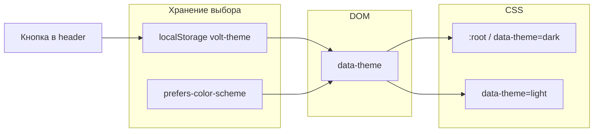

# План: светлая тема с переключателем

## Цель

Добавить **светлую цветовую тему** для сайта Вольтгрупп с возможностью переключения на клиенте. **Вёрстку, разметку секций и JS-логику секций не менять** — только цвета, тени и оверлеи через токены.

## Текущее состояние

- Тёмная тема задана CSS-переменными в [`src/styles/base.css`](../src/styles/base.css) (`:root`).
- Большинство стилей уже используют `var(--color-*)`.
- Есть **жёстко зашитые** цвета, их нужно вынести в токены (без изменения layout):

| Файл | Значение | Назначение |
|------|----------|------------|
| `layout.css` | `rgba(15, 15, 18, 0.9)` | фон header |
| `sections.css` | `linear-gradient(..., var(--color-bg))` | затемнение hero |
| `sections.css` | `rgba(0, 0, 0, 0.85)` | overlay портфолио |
| `sections.css` | `#000` в mask carousel | маска карусели |
| `components.css` | `rgba(0, 0, 0, 0.7)` | backdrop модалки |
| `components.css` | `#1a1a1f` | текст на `.btn--primary` |
| `sections.css` | `#1a1a1f` | fallback hero-bg |

## Архитектура тем



### Режимы

| `data-theme` | Поведение |
|--------------|-----------|
| `dark` | Текущая палитра (по умолчанию для совместимости) |
| `light` | Новая светлая палитра |
| не задан / `system` (опционально) | Следовать `prefers-color-scheme` до первого ручного выбора |

**Рекомендация:** по умолчанию оставить **dark** (как сейчас), light — по переключателю. При первом визите без `localStorage` — опционально `system` или `dark` (уточнить у заказчика; в реализации заложить `dark`).

## Палитра светлой темы (черновик)

Акцент **#e8c547** сохраняем — узнаваемость бренда. Меняются фоны и текст.

| Токен | Dark (текущий) | Light (предложение) |
|-------|----------------|---------------------|
| `--color-bg` | `#0f0f12` | `#f7f7f9` |
| `--color-bg-elevated` | `#1a1a1f` | `#ffffff` |
| `--color-bg-card` | `#222228` | `#eef0f4` |
| `--color-border` | `rgba(255,255,255,0.08)` | `rgba(15,15,18,0.1)` |
| `--color-text` | `#f2f2f4` | `#1a1a1f` |
| `--color-text-muted` | `#9a9aa8` | `#5c5c6b` |
| `--color-accent` | `#e8c547` | `#c9a020` (чуть темнее для контраста на белом) |
| `--color-accent-hover` | `#f0d56a` | `#ddb42e` |
| `--color-on-accent` | `#1a1a1f` | `#1a1a1f` |
| `--color-header-bg` | `rgba(15,15,18,0.9)` | `rgba(247,247,249,0.92)` |
| `--color-overlay-strong` | `rgba(0,0,0,0.85)` | `rgba(15,15,18,0.55)` |
| `--color-overlay-backdrop` | `rgba(0,0,0,0.7)` | `rgba(15,15,18,0.45)` |
| `--color-hero-fade` | `var(--color-bg)` | `var(--color-bg)` |
| `--color-carousel-mask` | `#000` | `#000` (маска без изменений) |
| `--shadow-card` | none / minimal | `0 4px 24px rgba(15,15,18,0.08)` (лёгкая глубина на light) |

Ошибки/успех (`--color-error`, `--color-success`) — без изменений или слегка приглушить на light при проверке контраста.

## Файлы (без смены вёрстки)

### 1. Новый файл стилей тем

[`src/styles/themes.css`](../src/styles/themes.css):

```css
:root,
[data-theme='dark'] {
  /* текущие переменные + новые токены оверлеев */
}

[data-theme='light'] {
  /* светлая палитра */
}
```

Подключить в [`src/styles/main.css`](../src/styles/main.css) **после** `base.css` (или перенести блок `:root` из `base.css` в `themes.css`).

### 2. Рефакторинг хардкода → токены

Заменить литералы в:

- [`src/styles/layout.css`](../src/styles/layout.css) → `var(--color-header-bg)`
- [`src/styles/sections.css`](../src/styles/sections.css) → `var(--color-overlay-strong)`, `var(--color-hero-fade)`
- [`src/styles/components.css`](../src/styles/components.css) → `var(--color-overlay-backdrop)`, `var(--color-on-accent)`

**Не трогать:** `grid`, `flex`, `padding`, `font-size`, `breakpoints`, порядок секций.

### 3. Переключатель темы (UI)

**Размещение:** [`src/scripts/layout.js`](../src/scripts/layout.js) — в `.header-actions`, рядом с «Обсудить проект» (иконка солнце/луна или текст «Светлая» / «Тёмная»).

```html
<button type="button" class="theme-toggle" data-theme-toggle aria-label="Переключить тему" aria-pressed="false">
  <!-- SVG inline или символ -->
</button>
```

- `min-height: 44px` (mobile)
- `aria-pressed` синхронизировать с темой
- Стили только в `components.css` / `layout.css` через переменные

### 4. Логика переключения

Новый модуль [`src/scripts/theme.js`](../src/scripts/theme.js):

```javascript
const STORAGE_KEY = 'voltgroup-theme';

export function getPreferredTheme() { /* localStorage → system → dark */ }
export function applyTheme(theme) { /* document.documentElement.dataset.theme */ }
export function initTheme() { /* apply + listen toggle */ }
export function toggleTheme() { /* dark ↔ light, save */ }
```

Подключить в:

- [`src/scripts/main.js`](../src/scripts/main.js)
- [`src/scripts/page-stub.js`](../src/scripts/page-stub.js)

**Порядок:** `initTheme()` до `mountLayout()`, чтобы header отрисовался уже с правильной `aria-pressed`.

### 5. Anti-FOUC (без мигания темы)

Во **все** HTML-точки входа добавить **инлайн-скрипт в `<head>`** (до CSS), ~5 строк:

- [`index.html`](../index.html)
- [`pages/*.html`](../pages/)

Читает `localStorage`, выставляет `document.documentElement.setAttribute('data-theme', ...)`.

Без этого при light + перезагрузке страница на мгновение будет тёмной.

### 6. Контент и изображения

- Hero, фото секций — **не менять** URL.
- На light может понадобиться чуть сильнее градиент hero (`--color-hero-fade`) для читаемости текста — только через CSS, без смены картинок.

### 7. Favicon (опционально, вне scope v1)

[`public/favicon.svg`](../public/favicon.svg) сейчас тёмный — для light можно позже добавить второй favicon через JS; **в v1 не обязательно**.

## Этапы реализации

| # | Задача | Проверка |
|---|--------|----------|
| 1 | Создать `themes.css`, перенести/дублировать токены dark + light | Визуально dark без регрессий |
| 2 | Заменить хардкод цветов на токены в layout/sections/components | `grep` без `#0f0f12` / `rgba(15` вне themes |
| 3 | `theme.js` + anti-FOUC во всех HTML | Перезагрузка без вспышки |
| 4 | Кнопка в header + `initTheme` в main/page-stub | Toggle на главной и stub-страницах |
| 5 | Контраст и a11y | WCAG AA для текста и кнопок на light |
| 6 | `prefers-color-scheme` (опционально) | Системная тема до первого клика |
| 7 | README: как менять палитру в `themes.css` | Документация |

## Критерии готовности

- [ ] Переключатель в header на всех страницах (главная + `pages/*`).
- [ ] Выбор сохраняется в `localStorage`, восстанавливается после F5.
- [ ] Светлая тема: светлый фон, тёмный текст, читаемый hero и карточки.
- [ ] Тёмная тема визуально как до изменений.
- [ ] Нет изменений в HTML-структуре секций и grid/flex layout.
- [ ] `npm run build` без ошибок.

## Риски

| Риск | Митигация |
|------|-----------|
| Низкий контраст акцента на белом | Темнее `--color-accent` только в light |
| Hero-текст плохо читается на фото | Усилить градиент через `--color-hero-fade` |
| FOUC | Inline script в `<head>` |
| Дублирование init на MPA | Один `theme.js`, подключение в main + page-stub |

## Вне scope

- Смена вёрстки, шрифтов, отступов.
- Отдельные темы для отдельных секций.
- Автосмена по времени суток.
- Редактор тем в админке.

## Оценка трудозатрат

~2–4 часа: токены + рефакторинг хардкода + toggle + anti-FOUC + проверка страниц.
