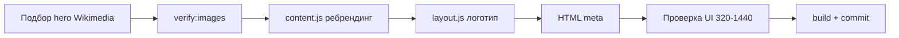

# План доработок: ребрендинг «Светотехника — Нижний»

## Цель

Переименовать компанию с «Вольтгрупп» на **«Светотехника — Нижний»**, провести **полный ребрендинг контента** под светотехническое бюро в Нижнем Новгороде и заменить **hero-фон** на фото **Нижегородской ярмарки** (проверенный URL Wikimedia).

**Вёрстку, структуру секций и JS-логику не менять** — только контент, meta-теги, логотип в header/footer и hero-изображение.

---

## Решения (согласовано)

| Вопрос | Ответ |
|--------|--------|
| Hero-картинка | Wikimedia Commons, URL проверить через `npm run verify:images` |
| Глубина изменений | Полный ребрендинг текстов под светотехнику и Н. Новгород |

---

## Карта изменений по файлам

### 1. Контент — единый источник правды

**Файл:** [`src/data/content.js`](../src/data/content.js)

| Блок | Что менять |
|------|------------|
| `site.name` | `Светотехника — Нижний` |
| `site.logoAccent` / `site.logoRest` | **Новые поля** для логотипа: `Светотехника` + `— Нижний` (акцент на первом слове) |
| `site.tagline` | Профильное светотехническое бюро, Нижний Новгород |
| `site.description` | Проектирование и монтаж освещения, фасады, интерьеры, объекты Нижнего и области |
| `site.city` | `Нижний Новгород` |
| `site.phone` | `+7 (831) 000-00-00` (заглушка с кодом 831) |
| `site.email` | `info@svetotehnika-nn.example` |
| `site.legalName` | `ООО «Светотехника — Нижний»` (или формулировка заказчика) |
| `site.copyright` | © 2026 Светотехника — Нижний |
| `images.hero` | **Фото Нижегородской ярмарки** (см. этап 2) |
| `featured` | Локальный объект, напр. «ЖК на Березовской» / «Центр на пл. Ярмарки» |
| `about` | Тексты про светодизайн, опыт в регионе, цифры — правдоподобные заглушки |
| `awards` | Награды/номинации (заглушки, без Lumos) |
| `services` | Акцент на проектирование освещения, поставку, монтаж (уже близко к референсу) |
| `portfolio` | 4 проекта с привязкой к Н. Новгороду / области |
| `footer.tagline` | Светотехническое бюро в Нижнем Новгороде |

Обновить `imageUrlsToVerify` после смены hero.

---

### 2. Hero — Нижегородская ярмарка

**Задача:** подобрать фото главного здания / комплекса ярмарки на Wikimedia Commons.

Кандидаты для проверки (примеры запросов):

- `Nizhny Novgorod Fair`
- `Central Exhibition Building Nizhny Novgorod`
- `Нижегородская ярмарка`

**Формат URL** (как сейчас в проекте):

```javascript
wiki('path/to/file.jpg')  // thumb 960px+
// или full + crop для hero 1920×1080
```

**Критерии выбора:**

- Горизонтальное фото, хорошо смотрится на full-width hero
- HTTP 200 и `content-type: image/*` при `npm run verify:images`
- Лицензия Commons (указать в комментарии в `content.js`, если нужно)

**CSS:** при необходимости усилить градиент hero для читаемости текста (`--color-hero-gradient-stop` в light/dark) — без смены layout.

---

### 3. Логотип в header / footer

**Файл:** [`src/scripts/layout.js`](../src/scripts/layout.js)

Сейчас захардкожено: `<span>Вольт</span>групп`.

**Заменить на** данные из `content.js`:

```javascript
<a class="logo" href="...">
  <span>${site.logoAccent}</span>${site.logoRest}
</a>
```

На узких экранах длинное имя не ломает вёрстку — проверить 320px (перенос или `font-size` через существующий `.logo`).

---

### 4. Meta-теги и title

| Файл | Поля |
|------|------|
| [`index.html`](../index.html) | `<title>`, `description`, `og:title`, `og:description` |
| [`pages/*.html`](../pages/) | title и description в 6 stub-страницах |

Шаблон: `{Раздел} — Светотехника — Нижний`.

---

### 5. Прочие упоминания бренда

| Файл | Действие |
|------|----------|
| [`src/scripts/page-stub.js`](../src/scripts/page-stub.js) | `section-label`: Светотехника — Нижний |
| [`src/scripts/discuss-form.js`](../src/scripts/discuss-form.js) | `console.log` prefix (косметика) |
| [`README.md`](../README.md) | Описание проекта под новое имя |

**Не менять (осознанно):**

- `vite.config.js` → `base: '/VoltGroup-Web/'` (имя **репозитория** GitHub)
- `localStorage`: `voltgroup-theme`, `voltgroup_discuss_submissions` (миграция не обязательна)
- `package.json` → `name: voltgroup-web` (внутреннее имя npm-пакета)

---

### 6. Опционально — локальное hero позже

В план заложить комментарий в `content.js`:

```javascript
// hero: '/VoltGroup-Web/images/hero-yarmarka.jpg' — заменить на своё фото
```

Пока используем только Wikimedia.

---

## Этапы реализации



| # | Этап | Проверка |
|---|------|----------|
| 1 | Найти и проверить URL ярмарки | `npm run verify:images` — OK для hero |
| 2 | Полный ребрендинг `content.js` | Нет «Вольтгрупп» в UI-текстах |
| 3 | Логотип из `site.logoAccent` / `logoRest` | Header + footer |
| 4 | Meta во всех HTML | View source / вкладка |
| 5 | Hero на light и dark теме | Текст читаем |
| 6 | `npm run build` | Без ошибок |
| 7 | Commit (+ push по запросу) | GitHub Pages обновится через Actions |

---

## Критерии готовности

- [ ] На сайте везде **«Светотехника — Нижний»**, нет «Вольтгрупп» в видимом UI
- [ ] Hero — **Нижегородская ярмарка**, картинка загружается
- [ ] Город, описание, услуги — **светотехника + Н. Новгород**
- [ ] Контакты с кодом **831** (заглушки)
- [ ] `npm run verify:images` проходит
- [ ] `npm run build` проходит
- [ ] Mobile + desktop без поломки логотипа

---

## Что нужно от заказчика (позже, не блокирует v1)

- Реальные телефон, email, ИНН, юр. название
- Свои фото проектов вместо Unsplash/Wikimedia
- Логотип SVG (если нужен вместо текстового)
- Точная формулировка названия: «Светотехника — Нижний» vs «Светотехника-Нижний» (дефис/тире)

---

## Оценка

~1.5–2.5 часа: подбор hero + контент + meta + проверка тем и адаптива.

## Вне scope

- Смена имени GitHub-репозитория
- Новый favicon под бренд
- SEO-тексты, блог, реальная отправка формы
